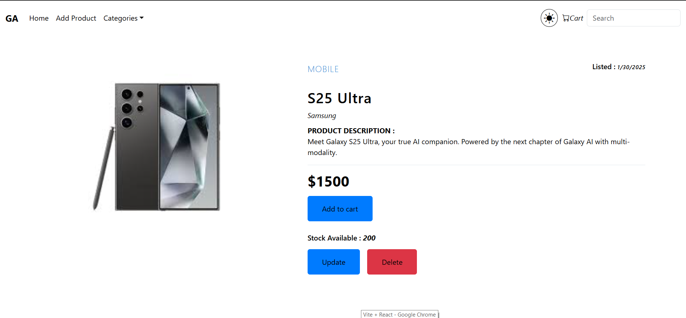
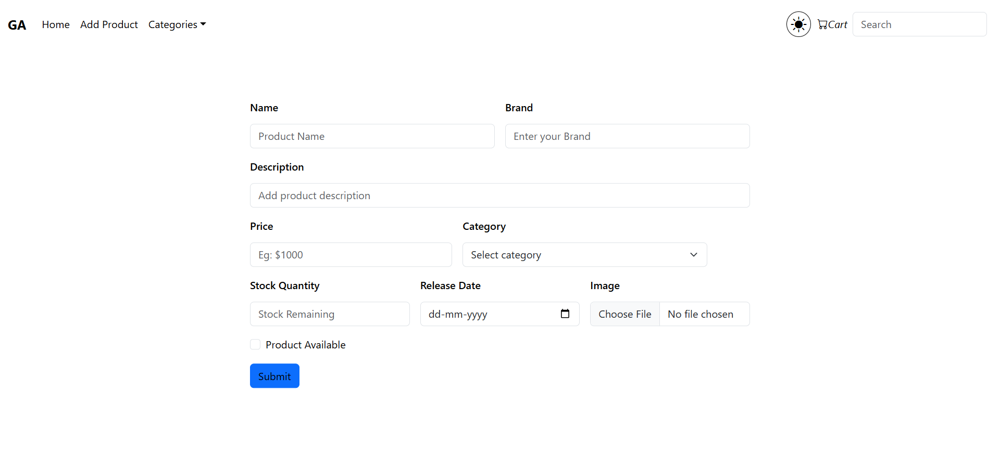

# E-commerce Platform

This project is an **E-commerce Platform** built using **React.js** and **Spring Boot**. It provides a robust and user-friendly interface for managing products, viewing product details, and managing a shopping cart. The platform integrates a modern UI with a responsive design to enhance the user experience.

---

## Table of Contents

- [Features](#features)
- [Technologies Used](#technologies-used)
- [Installation](#installation)
- [Usage](#usage)
- [Project Structure](#project-structure)
- [Screenshots](#screenshots)
- [License](#license)

---

## Features

- **Product Management**: Add, update, and view products.
- **Shopping Cart**: Manage items in the cart and proceed to checkout.
- **Responsive Design**: Optimized for mobile, tablet, and desktop devices.
- **Dynamic Navigation**: Integrated navigation bar for seamless user experience.
- **Popup Checkout**: Smooth and interactive checkout process.
- **API Integration**: Front-end communicates efficiently with the Spring Boot backend.
- **Light and Dark Mode**: Users can toggle between light and dark themes for better accessibility.
- **Search Feature**: Users can search for products by name.
- **Category Filtering**: Browse products by categories for easy navigation.

---

## Technologies Used

### Front-End
- **React.js**: JavaScript library for building user interfaces.
- **CSS**: Styling for a modern and responsive UI.
- **Axios**: For making HTTP requests.

### Back-End
- **Spring Boot**: Back-end framework for building RESTful APIs.
- **Hibernate**: ORM framework for database interaction.
- **MySQL**: Relational database management system.

---

## Installation

### Front-End

1. Clone the repository:
   ```bash
   git clone https://github.com/GeetanshAnand/Ecommerce-Frontend.git
   ```

2. Navigate to the front-end directory:
   ```bash
   cd Ecommerce-Frontend
   ```

3. Install dependencies:
   ```bash
   npm install
   ```

4. Start the development server:
   ```bash
   npm run dev
   ```

5. Access the application in your browser at:
   ```
   http://localhost:5173/
   ```

### Back-End

1. Clone the back-end repository:
   ```bash
   git clone https://github.com/GeetanshAnand/Ecommerce-Backend.git
   ```

2. Navigate to the back-end directory:
   ```bash
   cd Ecommerce-Backend
   ```

3. Configure the database connection in the `application.properties` file:
   ```properties
   spring.datasource.url=jdbc:mysql://localhost:3306/ecommerce_db
   spring.datasource.username=your_username
   spring.datasource.password=your_password
   ```

4. Build and run the application using Maven:
   ```bash
   mvn spring-boot:run
   ```

5. The backend will be accessible at:
   ```
   http://localhost:8081/
   ```

---

## Usage

- **Add Products**: Add new products to the database through the front-end.
- **View Products**: Browse the list of products and view their details.
- **Update Products**: Edit existing product details.
- **Shopping Cart**: Add products to the cart and manage the items.
- **Checkout**: Proceed with the checkout process seamlessly.
- **Search**: Find products quickly using the search feature.
- **Category Filtering**: Filter products by category for easier browsing.

---

## Project Structure

### Front-End

```plaintext
Ecommerce-Frontend
├── src
│   ├── assets                # Static assets like images
│   ├── components            # React components
│   │   ├── AddProduct.jsx    # Component to add products
│   │   ├── Cart.jsx          # Shopping cart component
│   │   ├── CheckoutPopup.jsx # Checkout popup
│   │   ├── Home.jsx          # Homepage
│   │   ├── Navbar.jsx        # Navigation bar
│   │   ├── Product.jsx       # Product card component
│   │   └── UpdateProduct.jsx # Component to update products
│   ├── Context               # Context API files for state management
│   │   └── Context.jsx
│   ├── App.css               # Global CSS
│   ├── App.jsx               # Main React app file
│   ├── axios.jsx             # Axios configuration
│   ├── main.jsx              # React entry point
│   └── index.html            # HTML entry point
└── vite.config.js            # Vite configuration
```

### Back-End

```plaintext
Ecommerce-Backend
├── src/main/java/com/geetansh/ecommerce
│   ├── controller            # Controllers for handling requests
│   │   ├── ProductController.java
│   ├── model                 # Entity classes
│   │   ├── Product.java
│   ├── repo                  # Repositories for database interaction
│   │   ├── ProductRepo.java
│   ├── service               # Business logic services
│   │   ├── ProductService.java
│   └── EcomProjectApplication.java # Main application class
├── src/main/resources
│   ├── application.properties # Configuration file
└── pom.xml                   # Maven configuration
```

---

## Screenshots

### 1. Home Page


### 2. Product Page


### 3. Cart Page


### 4. Add Product Page


### 5. Checkout Popup


---

## License

This project is licensed under the MIT License. You may use, modify, and distribute this project freely under the terms of the MIT License. See the [LICENSE](LICENSE) file for more details.
